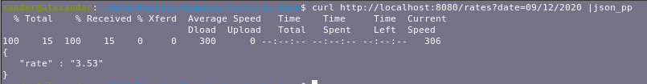

#vertx-ts-demo

###Description

This Project is an example of a Rest Api with Vert.x in Typescript


###Run the App

- Execute the following commands:
```
#!bash

npm install

npm run build

docker-compose -f deployments/docker-compose.yaml up -d --build

```

###Consume Api Rest

```
#!bash

curl http://localhost:8080/rates?date=09/12/2020 |json_pp

```



###### Author: ######
* Noel Chavez Simbron

[lexers]: http://pygments.org/docs/lexers/
[fireball]: http://daringfireball.net/projects/markdown/
[Pygments]: http://pygments.org/
[Extra]: http://michelf.ca/projects/php-markdown/extra/
[id]: http://example.com/  "Optional Title Here"
[BBmarkup]: https://confluence.atlassian.com/x/xTAvEw
